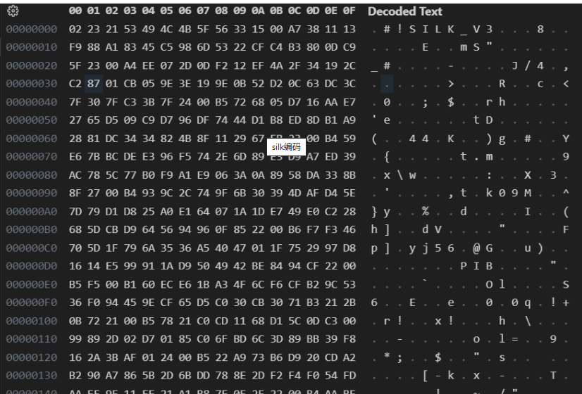

# python--微信语音-WeChatvoice
使用python对（WeChatvoice）微信数据库语音的一些获取
# 编码格式
微信的语音文件虽然扩展名为.amr，但内部却用的SILK编码格式：

所以先将这个amr的改为正确的silk格式写入silk的空文件中
    
    def modify_binary_data(data):  

      new_header = b'\xFF\xFF'  # 23 21 41 4D 52 0A  

      data =   data[1:-2]+new_header  

      return data  

found_file为获取的语音文件  

    with open(found_file, 'rb') as file:  

        data = file.read()  

        modified_data = modify_binary_data(data)#修改参数  

    with open('modified_amr_file.silk', 'wb') as file:  

        file.write(modified_data)  

此时就获取了正确编码的silk格式微信语音  

# 后续就随意转格式为需要的。  

  
   
    
    duration = pilk.decode("modified_amr_file.  
    silk", "test.pcm")#转pcm  
    pcm_file = 'test.pcm'
    music1 = pcm_file
    silk_file = 'modified_amr_file.silk'
    music2 = silk_file
    output_file = file_name+'.wav'
    music3 = output_file
    sample_rate = 24000
    channel = 1
    pcm2wav(pcm_file, output_file, channel,  
    sample_rate)#转wav
    total_size = os.path.getsize(output_file)

# SBSBSBSSBSBSBSBSSB微信强制版本更新导致多开版本强制更新然后就动不动就掉线

    看来。。我不得不离开南京。。不得不放弃。。所以通过多开批量获取
    聊天记录是不可行的，还是通过分布式来操作吧。

## 给安卓安装termux，写代码，http发送到服务器

### 一：安装termux
    去官网随便下个好了
    然后换一下镜像

    termux-change-repo

    下载python和依赖

    pkg install ncurses-utils

    pkg install wget

    pkg install sudo

    pip 换源

    pip config set global.index-url             https://pypi.tuna.tsinghua.edu.cn/simple
    也不必换慢慢下得了

    然后创建代码隐射

    termux-setup-storage

    ln -s /data/data/com.termux/files/home/storage/shared/0 0

    记得在手机目录创建0的文件夹。这样就省区adb挪到termux了

    然后弄个magic

    下个自启动的插件

    termux设置一个自启动运行的脚本

    安装Cron服务
    这个报错不要紧
    pkg install cron

    编辑Shell配置文件
    nano ~/.bashrc

    添加自动启动命令
    # 启动crond（如果未运行）
    if ! pgrep -x "crond" > /dev/null; then
        crond
    fi

    执行以下命令重新加载配置：
    source ~/.bashrc

    别忘了设置定时任务哦

    防止设备休眠进程停止
    termux-wake-lock

    设置里面各种设置给termux弄的多多的

    开启crontab
    crond

    步骤反了，记得先设置任务再设置脚本

    添加定时任务
    crontab -e
    
    这个定时任务，每分钟以root执行py
    * * * * * sudo python 0/fasong.py
    好啦，在安卓执行py并将微信的数据库带到服务器就完成了
    服务器代码为jiwwx.py
    安卓的定时代码为fasong.py
    都怪微信一直封，搞得这么麻烦还不好维护
#整体获取流程

